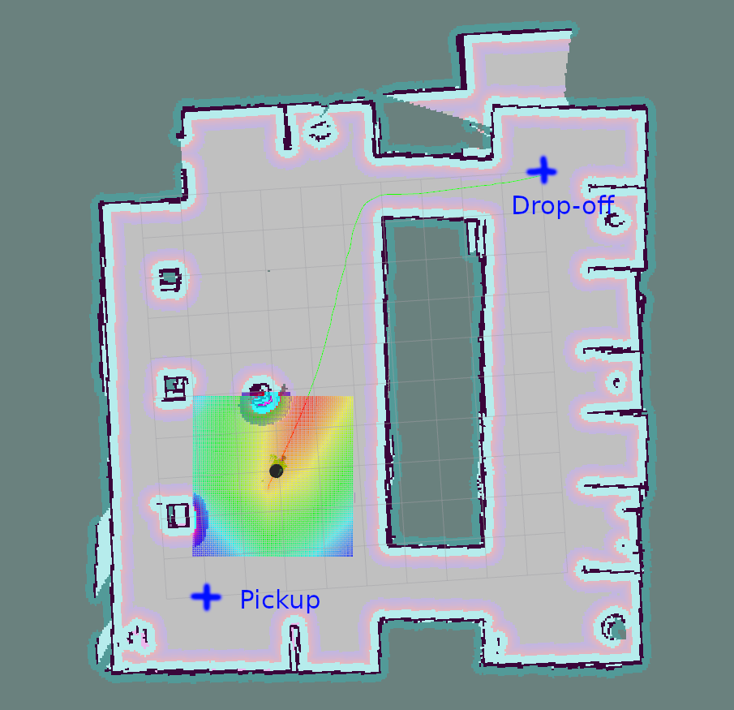

# Home Service Robot

## Dependencies

The application runs under Ubuntu 16.04 with ROS Kinetic.

The following packages need to be installed (if they are not already):
```shell script
sudo apt install xterm
sudo apt install ros-kinetic-openslam-gmapping
sudo apt install ros-kinetic-joy
sudo apt install ros-kinetic-kobuki
sudo apt install ros-kinetic-depthimage-to-laserscan
sudo apt install ros-kinetic-kobuki-desktop
sudo apt install ros-kinetic-turtlebot-apps
```
If the last line produces an error `ERROR: Could not download the required kernel sources to install RealSense camera support`, the error can be safely ignored.

## Install and Build

Clone the repository; it is a whole Catkin workspace:

```shell script
git clone https://github.com/fantauzzi/home_service_robot.git
```

Build the workspace:

```shell script
cd home_service_robot
catkin_make
```

## Run the Application

Directory `home_service_robot/scripts` contains a number of convenience scripts to run the application. Note that **you must source the Catkin workspace setup before running the scripts**. E.g. run from the root of the workspace (the cloned repository):

```shell script
source devel/setup.bash
cd scripts
bash home_service.sh
```

### test_slam.sh
Loads the environment in Gazebo and allows driving around a Turtlebot 2 robot to build a map with the gmapping ROS package. RViz displays the maps as it is being built. One of the xterm opened runs the keyboard teleop ROS node, click in the terminal window and you can use the keyboard to drive the robot.

Use the [map_server](http://wiki.ros.org/map_server) ROS node to save the map built so far:
```shell script
rosrun map_server map_saver -f /tmp/my_map
```
files for the default map used by the application are
```shell script
./src/pick_objects/maps/training_world.pgm
./src/pick_objects/maps/training_world.yaml
```

### test_navigation.sh 
Loads te environment in Gazebo and allows directing the robot using RViz `2D Nav Goal`. The robot drives to the set goal, using ROS navigation stack for SLAM and path planning.

## pick_objects.sh 
The robot wheels in the simulated environment to the pickup zone, displays a message that it reached its destination, waits 5 seconds, travels to the drop off zone, and displays a message that it reached the drop off zone. Messages are in a dedicated xterm.



## add_marker.sh
RViz displays a marker, a green cube, at the pickup zone. When the robot reaches it (it can be directed using RViz `2D Nav Goal`), the marker disappears, simulating pickup; when the robot reaches the delivery zone, RViz displays the marker there, simulating drop-off. See picture above for the location of the two zones.

## home_service.sh
The complete simulation:
- the robot travels to the marker in the pick-up zone; 
- when the robot reaches it, the marker disappears, and the robot pauses five seconds simulating pick-up; 
- the robot then travels to the drop-off zone;
- the marker appears at the drop-off zone when the robot reaches it. 

# How it Works
The application leverages the ROS [navigation package](http://wiki.ros.org/navigation/Tutorials/RobotSetup) and, for simulation and operation of the robot, the [TurtleBot 2 stacks](http://wiki.ros.org/Robots/TurtleBot#Robots.2FTurtleBot.2Fkinetic.TurtleBot2).

In addition, the application is comprised of two ROS nodes: `add_markers` and `pick_objects`. Their implementation is based on ROS tutorials.

Node `add_markers` uses the stack [tf2_ros](http://wiki.ros.org/tf2_ros) to track the pose of the robot base, transform it to the map reference frame, and determine when its position is close to the pickup or drop-off area. It also uses the RViz ability to [display markers](http://wiki.ros.org/rviz/Tutorials/Markers%3A%20Basic%20Shapes) on its graphic visualization. The node directs RViz to display and remove the marker by sending messages over topic `visualization_marker`.
